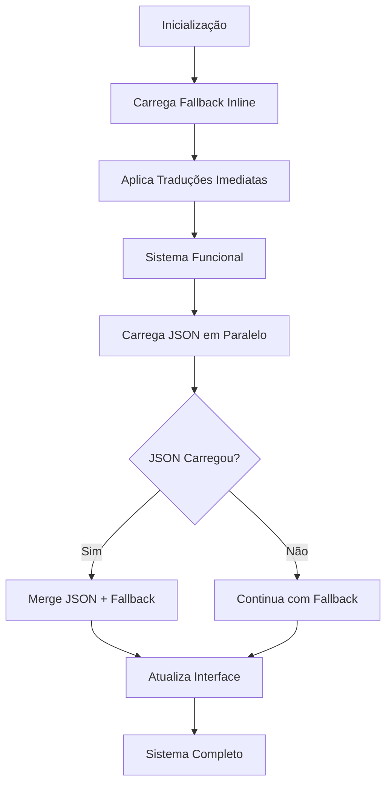

# Sistema Híbrido de Internacionalização (I18n)

## Visão Geral

O **Sistema Híbrido I18n** combina o melhor dos dois mundos: a flexibilidade do carregamento dinâmico de JSON com a confiabilidade das traduções inline como fallback. Isso garante que o sistema **sempre funcione**, mesmo quando há problemas de rede ou carregamento de arquivos.

## Como Funciona

### 1. Inicialização Dupla

```javascript
// 1. Primeiro: Carrega fallback inline (imediato)
this.translations = { ...this.fallbackTranslations };

// 2. Aplica traduções imediatamente
this.updateContent();

// 3. Em paralelo: Tenta carregar JSON (sem bloquear)
this.loadJsonTranslations();
```

### 2. Traduções Inline (Fallback)

```javascript
this.fallbackTranslations = {
    pt: {
        nav: { dashboard: "Dashboard", usuarios: "Usuários" },
        common: { save: "Salvar", cancel: "Cancelar" }
    },
    en: {
        nav: { dashboard: "Dashboard", usuarios: "Users" },
        common: { save: "Save", cancel: "Cancel" }
    }
    // ... mais idiomas
};
```

**Vantagens:**
- ✅ **Disponível imediatamente** - sem async/await
- ✅ **Sempre funciona** - mesmo sem conexão
- ✅ **Zero dependências** - não precisa de arquivos externos
- ✅ **Carregamento rápido** - já está em memória

### 3. Carregamento JSON (Dinâmico)

```javascript
async loadJsonTranslations() {
    try {
        const jsonTranslations = await fetch('./assets/data/translations.json');
        // Merge JSON com fallback (JSON tem prioridade)
        this.translations = this.mergeTranslations(this.fallbackTranslations, jsonTranslations);
        // Atualiza interface com dados mais completos
        this.updateContent();
    } catch (error) {
        // Sistema continua funcionando com fallback
        console.warn('Usando fallback:', error.message);
    }
}
```

**Vantagens:**
- ✅ **Traduções completas** - mais chaves e contextos
- ✅ **Fácil manutenção** - editar JSON é mais simples
- ✅ **Carregamento dinâmico** - pode ser atualizado sem deployar código
- ✅ **Estrutura hierárquica** - organização por contexto

### 4. Merge Inteligente

O sistema faz um **merge profundo** entre fallback e JSON:

```javascript
mergeTranslations(fallback, jsonData) {
    // JSON tem prioridade sobre fallback
    // Mas fallback garante que sempre há uma tradução
    return this.deepMerge(fallback, jsonData);
}
```

**Resultado:**
- Se JSON carregar: **JSON + Fallback** (completo)
- Se JSON falhar: **Apenas Fallback** (funcional)

## Fluxo de Funcionamento



## Vantagens da Abordagem Híbrida

### 1. **Confiabilidade Máxima**
- Sistema nunca falha por problemas de carregamento
- Sempre há traduções disponíveis
- Funciona offline

### 2. **Performance Otimizada**
- Interface traduzida **imediatamente**
- Carregamento JSON não bloqueia
- Atualizações progressivas transparentes

### 3. **Flexibilidade Total**
- Desenvolvimento: usa fallback rápido
- Produção: aproveita JSON completo
- Fácil expansão de idiomas

### 4. **Manutenibilidade**
- Fallback para traduções críticas
- JSON para traduções extensas
- Controle granular por contexto

## Estrutura de Arquivos

```
assets/
├── js/
│   ├── hybrid-i18n.js          # Sistema híbrido
│   ├── simple-i18n.js          # Versão simples (backup)
│   └── i18n.js                 # Versão complexa (referência)
├── data/
│   └── translations.json       # Traduções completas
└── ...

pages/
├── test-hybrid.html            # Demonstração híbrida
├── test-simple.html            # Demonstração simples
└── ...
```

## Como Usar

### 1. Incluir o Sistema

```html
<script src="./assets/js/hybrid-i18n.js"></script>
```

### 2. Marcar Elementos

```html
<h1 data-i18n="pages.dashboard.title">Dashboard</h1>
<button data-i18n="common.save">Salvar</button>
<input type="search" data-i18n="common.search" placeholder="Pesquisar">
```

### 3. Seletor de Idioma

```html
<div class="dropdown">
    <button class="btn dropdown-toggle" data-bs-toggle="dropdown">
        <span id="currentLanguageFlag">🇧🇷</span>
        <span data-i18n="common.language">Idioma</span>
    </button>
    <ul class="dropdown-menu">
        <li><a class="dropdown-item language-option" data-lang="pt">🇧🇷 Português</a></li>
        <li><a class="dropdown-item language-option" data-lang="en">🇺🇸 English</a></li>
        <li><a class="dropdown-item language-option" data-lang="es">🇪🇸 Español</a></li>
    </ul>
</div>
```

## Comparação das Abordagens

| Recurso | Sistema Simples | Sistema Híbrido | Sistema Complexo |
|---------|----------------|-----------------|------------------|
| **Velocidade inicial** | ⭐⭐⭐⭐⭐ | ⭐⭐⭐⭐⭐ | ⭐⭐⭐ |
| **Confiabilidade** | ⭐⭐⭐⭐⭐ | ⭐⭐⭐⭐⭐ | ⭐⭐⭐ |
| **Flexibilidade** | ⭐⭐⭐ | ⭐⭐⭐⭐⭐ | ⭐⭐⭐⭐⭐ |
| **Manutenção** | ⭐⭐⭐ | ⭐⭐⭐⭐ | ⭐⭐ |
| **Recursos avançados** | ⭐⭐ | ⭐⭐⭐⭐ | ⭐⭐⭐⭐⭐ |
| **Facilidade debug** | ⭐⭐⭐⭐⭐ | ⭐⭐⭐⭐ | ⭐⭐ |

## Casos de Uso Recomendados

### 🎯 **Sistema Híbrido** (Recomendado)
- Aplicações em produção
- Necessita alta confiabilidade
- Requer traduções extensas
- Equipe mista (dev + tradutores)

### 🚀 **Sistema Simples**
- Prototipagem rápida
- Poucas traduções
- Equipe técnica pequena
- Projetos internos

### 🔧 **Sistema Complexo**
- Aplicações muito grandes
- Recursos avançados (pluralização, formatação)
- Equipe experiente
- Tempo para debugging

## Próximos Passos

1. **Expansão de Traduções**: Adicionar mais contextos ao JSON
2. **Cache Inteligente**: Salvar JSON no localStorage
3. **Detecção de Idioma**: Auto-detectar idioma do browser
4. **Lazy Loading**: Carregar idiomas sob demanda
5. **Editor Visual**: Interface para editar traduções

## Monitoramento e Debug

O sistema híbrido inclui ferramentas de monitoramento:

```javascript
// Status completo do sistema
const status = window.hybridI18n.getStatus();
console.log(status);

// Adicionar traduções dinamicamente
window.hybridI18n.addTranslations(newTranslations);

// Event listener para mudanças
document.addEventListener('languageChanged', (e) => {
    console.log('Idioma:', e.detail.language);
    console.log('JSON ativo:', e.detail.jsonLoaded);
});
```

---

**Conclusão**: O sistema híbrido oferece o melhor equilíbrio entre confiabilidade, performance e flexibilidade, sendo ideal para a maioria dos projetos que precisam de internacionalização robusta.